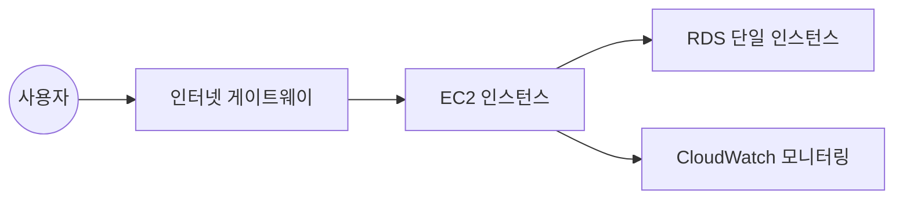
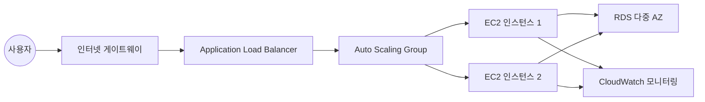
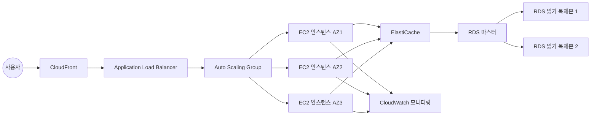
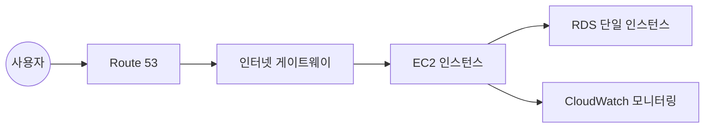
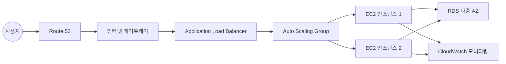
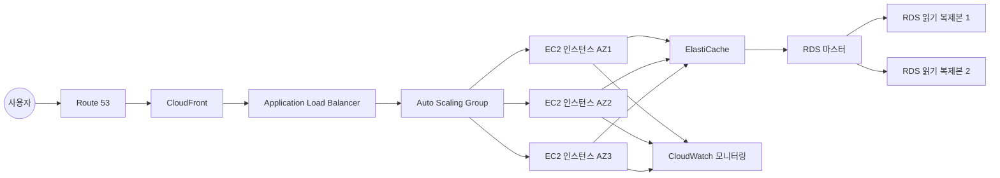

# 확장 가능한 Terraform 인프라 설계 문서

## 개요

이 문서는 소규모(10명 이하), 중규모(100명 이상), 대규모(1000명 이상) 사용자를 지원할 수 있는 확장 가능한 웹 애플리케이션 인프라의 설계를 설명합니다. 모든 인프라는 Terraform을 사용하여 코드로 정의되며, GitHub을 통해 버전 관리됩니다. 인프라 변경 시 자동으로 다이어그램이 생성되고 README 파일에 업데이트됩니다. 또한 인프라 상태를 모니터링하기 위한 간단한 대시보드가 구현됩니다.

## 아키텍처

### 전체 아키텍처 개요

인프라는 모듈화된 접근 방식을 사용하여 설계되며, 각 규모(소/중/대)에 맞는 구성을 쉽게 전환할 수 있도록 합니다. 모든 인프라는 AWS us-west-2 리전에 배포됩니다.

### 규모별 아키텍처

#### 소규모 아키텍처 (10명 이하)
- Route 53을 통한 DNS 관리 (www.jbshin.shop)
- 단일 EC2 인스턴스에서 실행되는 웹 애플리케이션
- RDS 단일 인스턴스 데이터베이스
- 기본 보안 그룹 및 IAM 설정
- CloudWatch 기본 모니터링

#### 중규모 아키텍처 (100명 이상)
- Route 53을 통한 DNS 관리 (www.jbshin.shop)
- Application Load Balancer를 통한 트래픽 분산
- Auto Scaling Group을 사용한 다중 EC2 인스턴스
- RDS 다중 AZ 구성
- 향상된 보안 그룹 및 IAM 설정
- CloudWatch 상세 모니터링 및 알람

#### 대규모 아키텍처 (1000명 이상)
- Route 53을 통한 DNS 관리 (www.jbshin.shop)
- CloudFront를 통한 콘텐츠 전송
- Application Load Balancer를 통한 트래픽 분산
- Auto Scaling Group을 사용한 다중 EC2 인스턴스 (여러 가용 영역에 분산)
- RDS 다중 AZ 구성 및 읽기 복제본
- ElastiCache를 통한 캐싱 계층
- 고급 보안 설정 및 WAF 구성
- 상세한 CloudWatch 모니터링, 알람 및 대시보드

## 컴포넌트 및 인터페이스

### 핵심 모듈

1. **네트워크 모듈**
   - VPC, 서브넷, 라우팅 테이블, 인터넷 게이트웨이 등 네트워크 인프라 구성
   - 각 규모에 맞는 네트워크 설정 제공

2. **컴퓨팅 모듈**
   - EC2 인스턴스, Auto Scaling Group, Launch Configuration 등 컴퓨팅 리소스 관리
   - 각 규모에 맞는 인스턴스 유형 및 용량 설정

3. **데이터베이스 모듈**
   - RDS 인스턴스, 파라미터 그룹, 서브넷 그룹 등 데이터베이스 리소스 관리
   - 각 규모에 맞는 데이터베이스 설정 제공

4. **로드 밸런싱 모듈**
   - Application Load Balancer, Target Group, 리스너 등 로드 밸런싱 리소스 관리
   - 중규모 및 대규모 아키텍처에서 사용

5. **캐싱 모듈**
   - ElastiCache 클러스터 및 관련 설정
   - 대규모 아키텍처에서 사용

6. **모니터링 모듈**
   - CloudWatch 대시보드, 알람, 로그 그룹 등 모니터링 리소스 관리
   - 각 규모에 맞는 모니터링 설정 제공

7. **보안 모듈**
   - 보안 그룹, IAM 역할, 정책 등 보안 리소스 관리
   - 각 규모에 맞는 보안 설정 제공

8. **다이어그램 생성 모듈**
   - 인프라 다이어그램 자동 생성 및 README 업데이트 기능
   - 여러 다이어그램 도구 지원 (AWS diagram MCP, Mermaid, Graphviz, D3)

9. **대시보드 모듈**
   - 간단한 웹 기반 대시보드 구현
   - 인프라 다이어그램, 비용 분석, 리소스 현황 표시

### 모듈 간 인터페이스

각 모듈은 명확한 입력 및 출력 변수를 통해 상호 작용합니다. 이를 통해 모듈 간 의존성을 관리하고 재사용성을 높입니다.

```hcl
# 예시: 네트워크 모듈 출력이 컴퓨팅 모듈 입력으로 사용
module "network" {
  source = "./modules/network"
  scale  = var.deployment_scale
  # 기타 입력 변수
}

module "compute" {
  source    = "./modules/compute"
  vpc_id    = module.network.vpc_id
  subnet_ids = module.network.private_subnet_ids
  scale     = var.deployment_scale
  # 기타 입력 변수
}
```

## 데이터 모델

### Terraform 상태 관리

Terraform 상태는 원격 백엔드(S3 + DynamoDB)를 사용하여 관리됩니다. 이를 통해 상태 파일의 안전한 저장 및 잠금 메커니즘을 제공합니다.

```hcl
terraform {
  backend "s3" {
    bucket         = "jbshin-kiro-terraform-state"
    key            = "terraform.tfstate"
    region         = "us-west-2"
    dynamodb_table = "terraform-state-lock"
    encrypt        = true
  }
}
```

### 변수 및 출력

주요 변수 및 출력은 다음과 같습니다:

1. **입력 변수**
   - `deployment_scale`: 배포 규모 (small, medium, large)
   - `aws_region`: AWS 리전 (기본값: us-west-2)
   - 기타 구성 변수

2. **출력 변수**
   - 웹 애플리케이션 엔드포인트 URL
   - 대시보드 URL
   - 각 모듈의 주요 리소스 ID 및 ARN

### 모듈 구성 파일

각 모듈은 다음 파일로 구성됩니다:
- `main.tf`: 주요 리소스 정의
- `variables.tf`: 입력 변수 정의
- `outputs.tf`: 출력 변수 정의
- `versions.tf`: 필요한 공급자 및 버전 정의

## 오류 처리

### Terraform 오류 처리

1. **입력 검증**
   - 모든 입력 변수에 대한 유효성 검사 수행
   - 잘못된 입력에 대한 명확한 오류 메시지 제공

2. **종속성 관리**
   - 리소스 간 명시적 종속성 정의
   - `depends_on` 속성을 사용하여 암시적 종속성 문제 해결

3. **조건부 생성**
   - `count` 또는 `for_each`를 사용하여 조건부 리소스 생성
   - 배포 규모에 따라 적절한 리소스만 생성

### 인프라 오류 처리

1. **상태 모니터링**
   - CloudWatch 알람을 사용하여 주요 지표 모니터링
   - 임계값 초과 시 알림 설정

2. **로깅**
   - CloudWatch Logs를 사용하여 애플리케이션 및 인프라 로그 수집
   - 로그 분석을 통한 문제 진단

## 테스트 전략

### Terraform 코드 테스트

1. **정적 분석**
   - `terraform validate`를 사용한 구문 검증
   - `terraform fmt`를 사용한 코드 형식 검사
   - `tflint`를 사용한 추가 정적 분석

2. **단위 테스트**
   - 각 모듈에 대한 단위 테스트 작성
   - `terraform-module-test`와 같은 도구 사용

3. **통합 테스트**
   - 전체 인프라 배포 테스트
   - 각 규모별 배포 테스트

### 인프라 테스트

1. **기능 테스트**
   - 배포된 인프라의 기능 검증
   - 엔드포인트 접근성, 로드 밸런싱, 오토스케일링 등 테스트

2. **부하 테스트**
   - 각 규모에 맞는 부하 테스트 수행
   - 성능 및 확장성 검증

## 다이어그램

### 인프라 다이어그램

아래는 각 규모별 인프라 구성을 보여주는 다이어그램입니다:

#### 소규모 아키텍처 다이어그램



#### 중규모 아키텍처 다이어그램



#### 대규모 아키텍처 다이어그램



### 대시보드 디자인

대시보드는 다음과 같은 구성 요소를 포함합니다:

1. 인프라 다이어그램 표시 영역
2. 비용 분석 차트 및 그래프
3. 리소스 현황 및 상태 표시
4. 주요 지표 모니터링 위젯

대시보드는 정적 HTML 파일로 구현되며, AWS SDK를 사용하여 필요한 데이터를 가져옵니다.#
# DNS 설계

### Route 53 구성

웹 애플리케이션에 대한 DNS 관리를 위해 AWS Route 53 서비스를 사용합니다. 도메인 이름 www.jbshin.shop을 통해 사용자가 애플리케이션에 접근할 수 있도록 설정합니다.

### 규모별 DNS 구성

#### 소규모 아키텍처
- Route 53 호스팅 영역 생성
- A 레코드를 사용하여 www.jbshin.shop을 EC2 인스턴스의 탄력적 IP에 연결

#### 중규모 아키텍처
- Route 53 호스팅 영역 생성
- 별칭(Alias) 레코드를 사용하여 www.jbshin.shop을 Application Load Balancer에 연결

#### 대규모 아키텍처
- Route 53 호스팅 영역 생성
- 별칭(Alias) 레코드를 사용하여 www.jbshin.shop을 CloudFront 배포에 연결
- 지연 시간 기반 라우팅 정책 적용 (필요시)

### DNS 업데이트 메커니즘

인프라 규모가 변경될 때 DNS 설정이 자동으로 업데이트되도록 Terraform 코드를 구성합니다. 이를 통해 최소한의 서비스 중단으로 새로운 인프라로 트래픽을 전환할 수 있습니다.

```hcl
# 예시: 배포 규모에 따른 조건부 DNS 레코드 생성
resource "aws_route53_record" "www" {
  zone_id = aws_route53_zone.main.zone_id
  name    = "www.jbshin.shop"
  type    = "A"

  # 소규모 배포인 경우 EC2 인스턴스로 직접 라우팅
  dynamic "alias" {
    for_each = var.deployment_scale == "small" ? [] : [1]
    content {
      name                   = var.deployment_scale == "medium" ? aws_lb.main[0].dns_name : aws_cloudfront_distribution.main[0].domain_name
      zone_id                = var.deployment_scale == "medium" ? aws_lb.main[0].zone_id : aws_cloudfront_distribution.main[0].hosted_zone_id
      evaluate_target_health = true
    }
  }

  # 소규모 배포인 경우에만 EC2 인스턴스 IP 사용
  ttl     = var.deployment_scale == "small" ? 300 : null
  records = var.deployment_scale == "small" ? [aws_eip.web[0].public_ip] : null
}
```

### 다이어그램 업데이트

각 규모별 아키텍처 다이어그램을 DNS 구성을 포함하도록 업데이트합니다:

#### 소규모 아키텍처 다이어그램 (DNS 포함)



#### 중규모 아키텍처 다이어그램 (DNS 포함)



#### 대규모 아키텍처 다이어그램 (DNS 포함)

