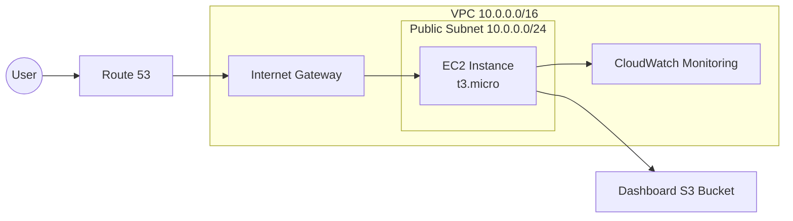

# Scalable Terraform Infrastructure

This project implements a scalable infrastructure using Terraform that can be deployed in three different scales: small, medium, and large. The infrastructure is designed to automatically adapt to different load requirements.

## Architecture Overview

The infrastructure is built with a modular approach, allowing for easy scaling and maintenance. It consists of the following components:

- **Network Module**: VPC, subnets, internet gateway, route tables, and DNS configuration
- **Compute Module**: EC2 instances, auto scaling groups, and security groups
- **Load Balancer Module**: Application Load Balancer and CloudFront distribution (for medium and large scales)
- **Monitoring Module**: CloudWatch dashboards, alarms, and logs
- **Security Module**: IAM roles, policies, and security groups
- **Dashboard Module**: Web-based dashboard for infrastructure monitoring

## Small Scale Infrastructure Diagram



## Deployment Scales

The infrastructure can be deployed in three different scales:

### Small Scale
- Single EC2 instance in a public subnet
- Direct DNS routing to the EC2 instance
- Basic CloudWatch monitoring
- Suitable for up to 10 concurrent users

### Medium Scale
- Auto Scaling Group with instances in private subnets
- Application Load Balancer for traffic distribution
- Enhanced CloudWatch monitoring and alarms
- Suitable for up to 100 concurrent users

### Large Scale
- Auto Scaling Group with increased capacity
- CloudFront distribution for global content delivery
- ElastiCache for improved performance
- WAF for enhanced security
- Comprehensive monitoring and alerting
- Suitable for 1000+ concurrent users

## Automatic Scaling

The infrastructure includes an automatic scaling mechanism that can transition between different scales based on the number of concurrent users:

- **Small to Medium**: Transitions when concurrent users exceed 10
- **Medium to Large**: Transitions when concurrent users exceed 100
- **Large to Medium**: Transitions when concurrent users drop below 70 (hysteresis to prevent flapping)
- **Medium to Small**: Transitions when concurrent users drop below 7 (hysteresis to prevent flapping)

## Deployment Instructions

### Prerequisites
- Terraform v1.0.0 or later
- AWS CLI v2.0.0 or later
- AWS account with appropriate permissions

### Deployment Steps

1. Clone the repository:
```bash
git clone https://github.com/yourusername/scalable-terraform-infrastructure.git
cd scalable-terraform-infrastructure/terraform
```

2. Initialize Terraform:
```bash
terraform init
```

3. Deploy the infrastructure:
```bash
# For small scale deployment
./test_small_deployment.sh --apply

# For scale transition testing
./test_scale_transition.sh --scale small|medium|large --auto true|false --users COUNT
```

4. Access the dashboard:
The dashboard URL will be provided in the Terraform outputs.

## Testing

The project includes test scripts for validating the infrastructure:

- `test_small_deployment.sh`: Tests the small-scale deployment
- `test_scale_transition.sh`: Tests the scale transition mechanism

## Cleanup

To destroy the infrastructure:
```bash
terraform destroy -var="deployment_scale=small" -var="auto_scale_enabled=false"
```

## Last Updated

This README was last updated on: July 23, 2025